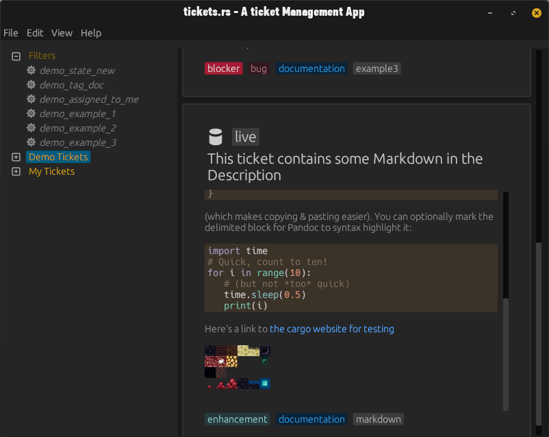

# Tickets.rs - A Ticket Management Tool

Tickets.rs is a Desktop application made with egui, that is used for managing and modifying Tickets (or Issues, Tasks, TODO's). It's goal is to have the choice between multiple different Adapters, that can interface with different
Systems out there, or locally to keep everything in one place: **this App**.

Currently supported Language is **English** only.

## Features

* Written in _100% safe Rust_.
* Manage, edit and move Tickets from different Sources in one place
* Add Tags to Tickets, to make them easily sortable
* Create Categories or "Buckets" to sort Tickets in
* Create Filters to view specific Combinations of Tickets, even across multiple Adapters
* Write and view Descriptions with Commonmark (similar to Markdown)
* Change the appearance of the Tool on the Fly (including Font Size and custom Colors)
* Remove and Add Ticket Sources or "Adapters" to and from the App without needing to restart
* Includes a little Wizard to get started quickly

## Currently Supported Adapters
* _local:_ Tickets are stored on the Computers Hard Drive in the form of a SQLite Database. In Theory you can put this File on a Network Folder, but i haven't tested, how it reacts to being already locked. I use it via sshfs successfully.
* _github:_ Ticket are being read from Github and cached (updated every 5 Minutes on request). There are no Filters yet, and it is purely read only. You need to supply a personal Access Token. So far i only managed to get all my Public Repositories to show (not sure, if that's any different with different Plans). However, you can also display the Repo List of other accounts via this Adapter. It is very barebones, doesn't include any Comments or details of why an issue is open/closed and no Pull Requests.

## Getting Started (from Source)

The Program is written in Rust, therefore you need to have all the necessary Tools for it installed.
It is rather easy though:

* if you haven't installed Rust or Cargo, do what [this guide](https://doc.rust-lang.org/cargo/getting-started/installation.html) says.
* Download this Repository as a .zip File and extract it or clone it with: `git clone`. (Requires git)
* Open up the Terminal and navigate into the Folder you just downloaded until you have found the directory with the _Cargo.toml_ in there and type `cargo build --release`
* After the build is done, there should be a new Folder called _target/release_, which will contain an executable called _tickets-rs_. Copy this file into a folder of your choice and run it.
* If you navigate out of the _target_ folder, you should find an _assets_ folder. Copy it into the same folder as the executable. It contains all the images, the app needs.
* _(Optional)_ make a shortcut to the executable.

## Getting started (with Binaries)

There is a new branch available called _releases_. In there you should be able to find the zip files of the binaries, so you can just download the version you need, unpack it and run it.

* [Go to Windows 10+ Releases Folder](https://github.com/TheBiochemic/tickets-rs/tree/releases/win_versions)
* [Go to Ubuntu Releases Folder](https://github.com/TheBiochemic/tickets-rs/tree/releases/ubuntu_versions)

## Contributors

The Tool is written by me, _Robert Lang (Biochemic)_ as a Project to learn Rust and advance my
prototype of an already personally built and used Software in Python.

## License

You find the License in the LICENSE File inside of this Repository. But as tl;dr it's GPLv3.
